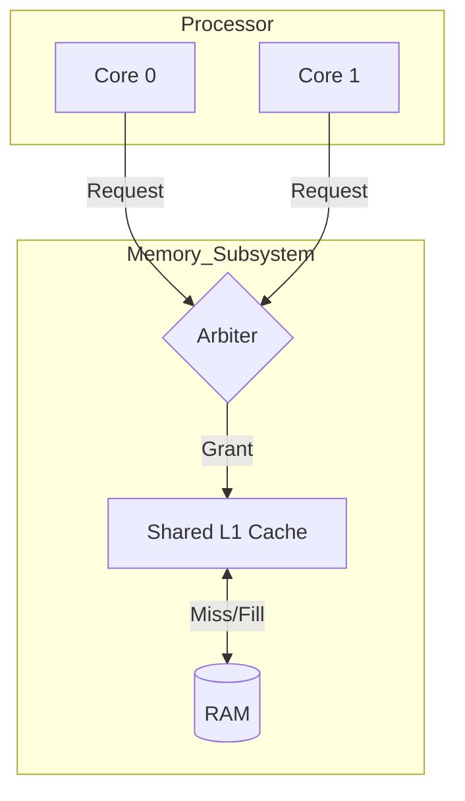

# Dual-Core Processor Architecture and FreeRTOS-based Operating System

## Project Overview
This repository documents the **design and implementation of a MIPS-inspired dual-core processor architecture** along with a **custom FreeRTOS-based operating system port**.

The hardware is designed and verified using **MATLAB/Simulink**, featuring two MIPS-like cores that share a common memory subsystem. A **round-robin arbiter** manages memory access to a shared L1 cache and main RAM, ensuring fairness and correctness.

On the software side, **FreeRTOS** has been modified to support **dual-core execution**, including changes to the scheduler, context switcher, and Board Support Package (BSP). To ensure correctness before hardware deployment, the OS is first validated using an **x86 (Windows) simulation environment**.

This project focuses on **computer architecture**, **operating systems**, and **hardware–software co-design**, and is intended for academic and research use.

---

## Key Features

### Hardware
- **MIPS-inspired dual-core processor**
- **Two independent 5-stage pipelines:** IF, ID, EX, MEM, WB
- **Support for R-type, I-type, and J-type instructions**
- **Shared L1 cache**
  - Dual read ports
  - Single write port
  - Write-through cache policy
- **Round-robin arbiter**
  - Fair access without starvation
  - Concurrent reads
  - Serialized writes
  - Cache miss handling and RAM coordination
- **Single-write-port RAM model** with handshake-based interface

### Software (FreeRTOS)
- **Dual-core FreeRTOS scheduler**
- **Independent per-core context switching**
- **Custom Board Support Package (BSP)**
- **Inter-core synchronization** using mutexes and semaphores
- **Functional verification** using x86 (Windows) simulation

---

## System Architecture Overview



- Both cores request memory access during the **MEM stage**.
- The arbiter grants access using a **round-robin policy**.
- Read operations may proceed **concurrently** on cache hits.
- Write operations are **serialized** through a single write path.
- Cache misses **stall** the requesting core until RAM fill completes.

---

## Repository Structure

```text
.
├── project_documentation.pdf     # Full architectural details and specs
│
├── hardware/
│   ├── cores/                    # MIPS-like core datapath and pipeline models
│   ├── arbiter/                  # Round-robin arbiter FSM and control logic
│   ├── cache/                    # Shared L1 cache implementation
│   ├── ram/                      # RAM model with read/write handshake
│   └── simulink_models/          # Top-level and integrated Simulink designs
│
├── software/
│   ├── freertos_port/            # Modified FreeRTOS kernel for dual-core
│   ├── bsp/                      # Board Support Package (timers, interrupts)
│   ├── tasks/                    # Example FreeRTOS tasks and benchmarks
│   └── x86_simulation/           # Windows-based simulation for verification
│
└── tests/
    ├── hardware_tests/           # Arbiter, cache, and RAM testbenches
    └── software_tests/           # Scheduler, context-switch, and sync tests
```

> **Note:**
> The complete architectural details, signal mappings, FSMs, pseudocode, and verification strategy are documented in **`project_documentation.pdf`**.

---

## Getting Started

### Prerequisites
- MATLAB / Simulink
- FreeRTOS source code
- C/C++ compiler
- Optional MIPS cross-compiler
- Windows OS (for x86 simulation)

### Running the Hardware Model
1. Open MATLAB and add the repository to the MATLAB path.
2. Navigate to `hardware/simulink_models/`.
3. Open the top-level Simulink model.
4. Run the simulation.
5. **Observe:**
   - Arbiter grant signals
   - Cache hit/miss behavior
   - Pipeline stalls during memory access

### Running the FreeRTOS Simulation (x86)
1. Navigate to `software/x86_simulation/`.
2. Build the FreeRTOS Windows port.
3. Run the executable.
4. **Verify:**
   - Task creation and scheduling
   - Dual-core execution behavior
   - Context switching
   - Synchronization using mutexes and semaphores

*This step validates OS correctness before deployment on hardware.*

---

## Verification and Testing

### Hardware
- **Arbiter fairness verification:** Ensuring no core is starved.
- **Concurrent read validation:** Checking simultaneous reads on cache hits.
- **Write serialization checks:** Confirming writes do not conflict.
- **Cache miss and RAM fill behavior:** Validating data integrity during fills.

### Software
- **Scheduler stress testing:** High load task switching.
- **Context switch latency measurement:** Efficiency checks.
- **Inter-core synchronization:** Correctness of mutexes/semaphores.
- **Benchmark task execution:** Performance validation.

---

## Contributing
Respectable and meaningful contributions are appreciated.

You are welcome to:
- Improve processor or memory architecture.
- Optimize arbiter or cache logic.
- Extend FreeRTOS kernel functionality.
- Add documentation or test cases.

Please ensure contributions are **clean, well-documented, and technically justified**.

---

## License
No license has been specified.

---

## Acknowledgements
This project was developed as part of a custom processor development effort, combining concepts from **computer architecture**, **real-time operating systems**, and **hardware–software co-design**.
